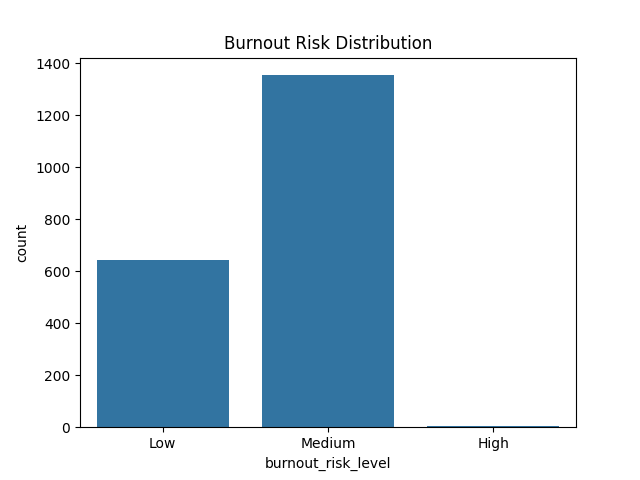
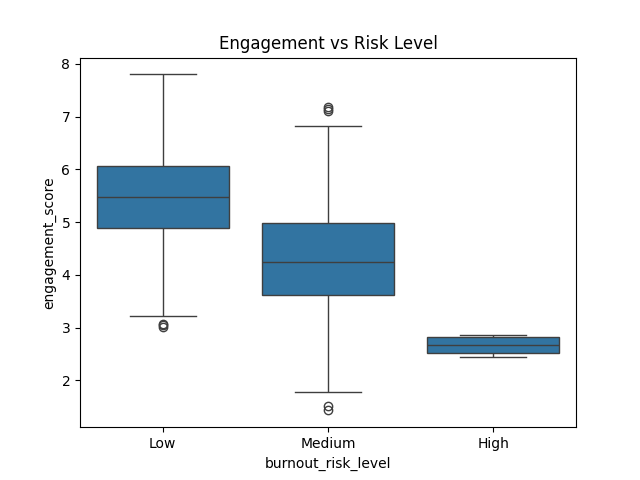
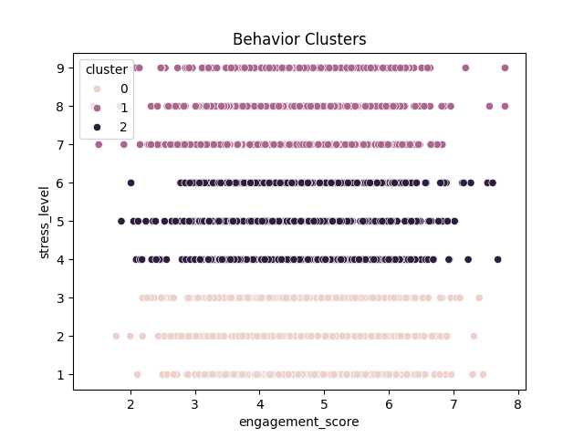
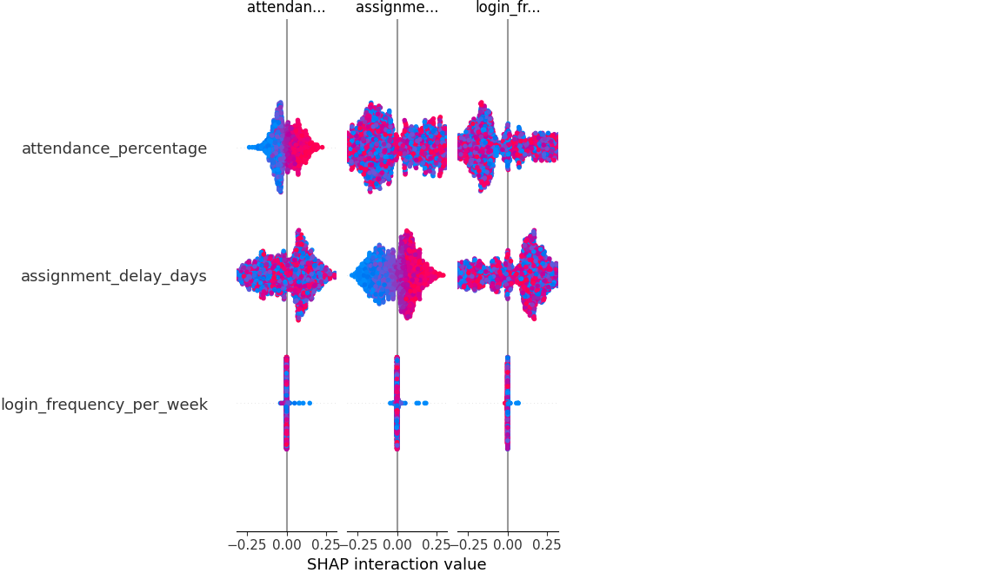

# 🎓 Student Burnout Behavioral Analytics and Early Warning System

## 📌 Overview

This project is a **Behavioral Analytics and Machine Learning system** designed to detect, explain, predict, and prevent student burnout using behavioral patterns.

Unlike traditional systems that detect burnout only after performance drops, this system analyzes behavioral signals such as engagement, attendance, stress, and activity irregularity to:

- Predict burnout risk level
- Explain behavioral causes using Explainable AI (SHAP)
- Simulate intervention impact
- Rank students by intervention priority
- Provide early warning alerts
- Visualize behavioral patterns in an interactive dashboard

This system transforms burnout detection into a **proactive behavioral intelligence platform**.

---

## 🚀 Key Features

### 1. Behavioral Risk Prediction
Predicts student burnout risk level using behavioral data.

Risk Levels:
- Low Risk
- Medium Risk
- High Risk

Based on:

- Attendance
- Engagement score
- Stress level
- Sleep hours
- Assignment delays
- Behavioral irregularity

---

### 2. Explainable AI (SHAP)

Explains WHY a student is at risk.

Instead of just predicting burnout, the system identifies:

- Most influential behavioral factors
- Feature importance rankings
- Behavioral patterns contributing to burnout

This improves trust and interpretability.

---

### 3. Behavioral Clustering

Segments students into behavioral groups using unsupervised learning.

Identifies groups such as:

- Highly engaged students
- Moderately engaged students
- Burnout-prone students

Helps institutions design targeted interventions.

---

### 4. Intervention Impact Simulator ⭐ (WOW Feature)

Allows administrators to simulate behavioral improvements and observe impact on burnout risk.

Example:

Before Intervention:
- Attendance: 55%
- Stress: 8
- Risk Level: High

After Intervention:
- Attendance: 75%
- Stress: 5
- Risk Level: Medium

This enables proactive intervention planning.

---

### 5. Risk Ranking and Early Warning System ⭐ (WOW Feature)

Ranks students based on burnout risk and future risk prediction.

Identifies:

- Highest priority students
- Students likely to become high risk soon
- Students requiring immediate intervention

This helps institutions allocate resources efficiently.

---

### 6. Behavioral Risk Timeline

Simulates burnout progression over time based on behavioral velocity.

Shows:

- Risk progression trend
- Early warning signals
- Intervention timing importance

---

### 7. Interactive Dashboard

Provides a professional dashboard with multiple tabs:

- Overall Behavioral Analytics
- Individual Student Analysis
- Intervention Simulator
- Risk Timeline
- Explainable AI
- Risk Ranking and Early Warning
- Behavioral Insights

---

## 📊 Behavioral Insights and Interpretations

Behavioral analysis results show clear patterns:

From `outputs/behavioral_insights.txt`:

- High risk students have average engagement score of 2.66 vs 5.45 for low risk
- High risk students attendance is 49.5% vs 77.6% for low risk
- High risk students stress level is 7.75 vs 4.06 for low risk

Interpretation:

Lower engagement, lower attendance, and higher stress strongly correlate with burnout risk.

---

## 📈 Visualizations

### Burnout Risk Distribution

Interpretation:

Most students fall in Medium risk category. High risk students require immediate intervention.

---

### Engagement vs Burnout Risk

Interpretation:

Students with lower engagement have significantly higher burnout risk.

Engagement is one of the strongest behavioral predictors.

---

### Behavioral Clustering

Interpretation:

Students naturally cluster into behavioral groups based on engagement and stress.

Helps identify vulnerable behavioral profiles.

---

### Explainable AI (SHAP)

Interpretation:

Top predictors of burnout:

- Engagement score
- Attendance percentage
- Stress level

These features have the strongest behavioral influence.

---

## 🧠 Machine Learning Model

Algorithm Used:

Random Forest Classifier

Why Random Forest:

- High accuracy
- Handles behavioral data well
- Robust to noise
- Provides feature importance

Model predicts:

- Burnout risk level
- Risk probability

Model files:
- `models/burnout_model.pkl`
- `models/scaler.pkl`

---

## ⚙️ Installation and Setup

Step 1: Install dependencies

pip install -r requirements.txt

---

Step 2: Train model (optional)

cd src
python train_model.py

---

Step 3: Generate behavioral insights

python behavior_analysis.py
python clustering.py
python shap_explainer.py

---

Step 4: Run dashboard

cd dashboard
python -m streamlit run app.py

---

Step 5: Open dashboard in browser

http://localhost:8501

---

## 📊 Dashboard Features

### Overall Analytics

Shows:

- Risk distribution
- Behavioral patterns
- Engagement vs stress

---

### Student Analysis

Shows:

- Individual behavioral profile
- Burnout risk prediction
- Intervention recommendations

---

### Intervention Simulator

Simulates behavioral improvements and shows impact on burnout risk.

---

### Risk Timeline

Shows behavioral risk progression over time.

---

### Explainable AI

Shows feature importance and behavioral influence.

---

### Risk Ranking

Shows priority students and early warning alerts.

---

## 🎯 Real World Applications

This system can be used by:

- Universities
- Educational institutions
- Online learning platforms
- Student counseling systems

To:

- Detect burnout early
- Prevent student dropout
- Improve student wellbeing

---

## 📈 Behavioral Analytics Contribution

This project demonstrates:

- Behavioral pattern analysis
- Behavioral risk prediction
- Behavioral segmentation
- Behavioral explainability
- Behavioral intervention planning

---

## 🔬 Future Improvements

Possible enhancements:

- Real-time LMS integration
- Longitudinal behavioral tracking
- Personalized intervention AI
- Deep learning models

---

## 🏆 Hackathon Value

This project goes beyond prediction.

It provides:

- Prediction
- Explanation
- Simulation
- Prevention
- Intervention planning

This makes it a complete Behavioral Intelligence System.
